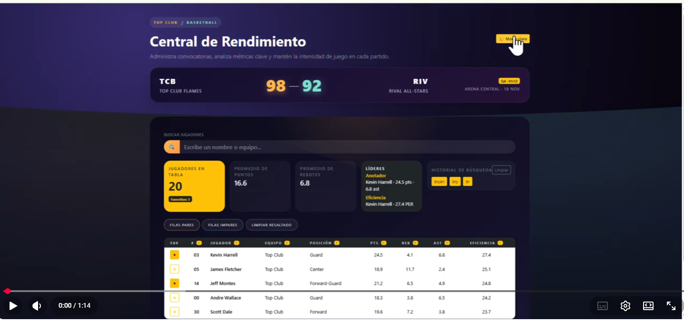

<div align="center">


</div>

<p align="center">
  
  
  
  
  
</p>

<p align="center">
  
  
  
</p>

<br/>

<p align="center">
  
</p>

<p align="center">
  <b> Replica moderna de una plataforma de estadísticas de jugadores de basketball.</b><br/>
  <sub>Diseño dinámico · Modo oscuro/claro · Sistema de favoritos · Visualización detallada</sub>
</p>

<br/>

---

<h2 style="font-family:'Inter',sans-serif; background:#6A0572; color:#fff; padding:12px; text-align:center; border-radius:6px;">Descripción</h2>

<br/>

> Este proyecto consiste en la **recreación de una interfaz web** inspirada en una plataforma profesional de rendimiento deportivo para jugadores de basketball.

La aplicación permite **visualizar estadísticas**, explorar jugadores, marcar favoritos y alternar entre modo oscuro y claro mediante una interfaz moderna e interactiva.

El objetivo principal fue **replicar el diseño de una página deportiva profesional** aplicando buenas prácticas de maquetación, estilos y componentes dinámicos con React.

<br/>

---

<h2 style="font-family:'Inter',sans-serif; background:#C0392B; color:#fff; padding:12px; text-align:center; border-radius:6px;">Funcionalidades</h2>

<br/>

<table>
  <tr>
    <td>📊 <b>Estadísticas de jugadores</b></td>
    <td>Visualización completa de métricas por jugador</td>
  </tr>
  <tr>
    <td>🗂️ <b>Tabla dinámica</b></td>
    <td>Listado interactivo con filtros y búsqueda</td>
  </tr>
  <tr>
    <td>⭐ <b>Sistema de favoritos</b></td>
    <td>Guarda tus jugadores preferidos fácilmente</td>
  </tr>
  <tr>
    <td>🌙 / ☀️ <b>Modo oscuro y claro</b></td>
    <td>Alterna el tema visual con un solo clic</td>
  </tr>
  <tr>
    <td>👤 <b>Vista detallada</b></td>
    <td>Información completa de cada jugador</td>
  </tr>
  <tr>
    <td>🔍 <b>Barra de búsqueda</b></td>
    <td>Encuentra jugadores al instante</td>
  </tr>
  <tr>
    <td>📱 <b>Diseño responsive</b></td>
    <td>Adaptado a todos los tamaños de pantalla</td>
  </tr>
  <tr>
    <td>🏟️ <b>Interfaz profesional</b></td>
    <td>Inspirada en dashboards deportivos reales</td>
  </tr>
</table>

<br/>

---

<h2 style="font-family:'Inter',sans-serif; background:#1A237E; color:#fff; padding:12px; text-align:center; border-radius:6px;">Tecnologías Utilizadas</h2>

<br/>

<div align="center">

| 🔧 Tecnología | 🎯 Uso |
|:---:|:---|
|  | Componentes dinámicos e interactivos |
|  | Estructura semántica del proyecto |
|  | Estilos, animaciones y diseño visual |
|  | Organización y nomenclatura de clases CSS |
|  | Control de versiones |
|  | Despliegue y hosting del proyecto |

</div>

<br/>

---


<br/>

El diseño está inspirado en **interfaces deportivas modernas** con una identidad visual impactante:

```
🌑  Gradientes oscuros premium
💡  Tarjetas con efecto de luz
🟠  Acentos en color naranja neón
✍️  Tipografía moderna y limpia
🖱️  Componentes 100% interactivos
✨  Experiencia visual profesional
```

<br/>

---


<br/>

```bash
📦 basketball-dashboard
 ┣ 📂 assets          # Imágenes y recursos estáticos
 ┣ 📂 components      # Componentes React reutilizables
 ┣ 📂 css             # Hojas de estilo globales y módulos
 ┣ 📂 js              # Lógica auxiliar y utilidades
 ┣ 📜 App.jsx         # Componente raíz de la aplicación
 ┣ 📜 main.jsx        # Punto de entrada principal
 ┗ 📜 README.md       # Documentación del proyecto
```

<br/>

---

<div align="center">


<sub>Hecho con 🧡 · Parcial Final · 2026</sub>

</div>
